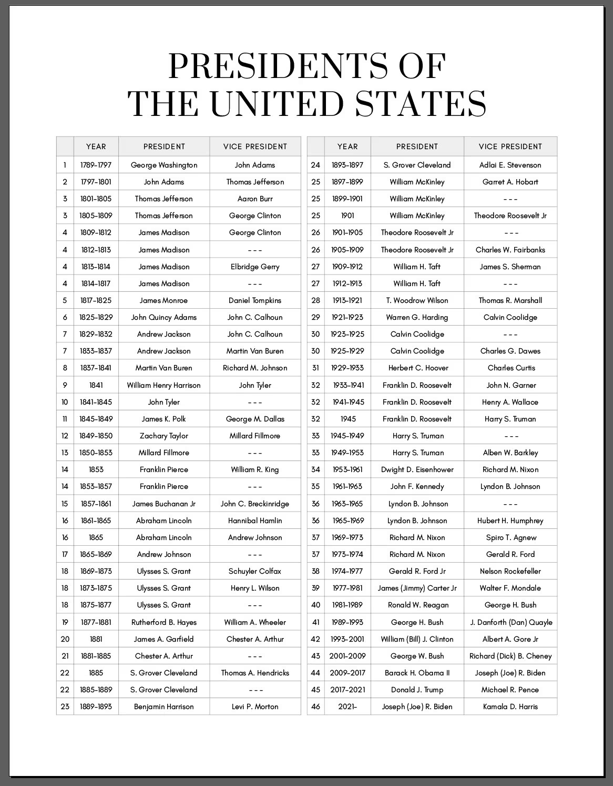
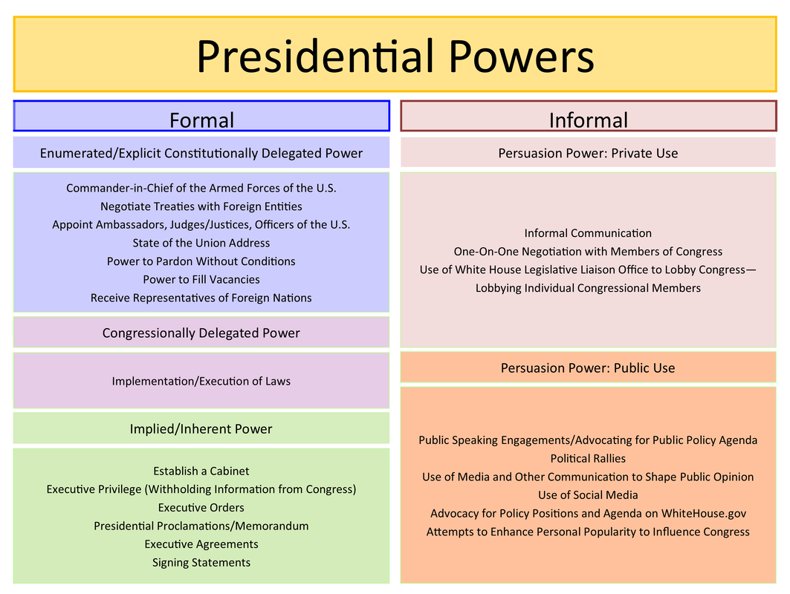

# The Presidency in the Constitution

## Creating the Presidency: A Contentious Matter

### Background

The political arrangements in place during the war between the British and those living in the colonies were insufficient and underdeveloped.

> During the period leading up to and during the war between the British and the American colonies (American Revolutionary War), the political arrangements were indeed fraught with challenges. Here's a breakdown to explain this in more detail:
>
> 1. **Colonial Governance**: The American colonies were primarily governed by British colonial policies and laws. However, there was a growing sentiment among the colonists that they lacked proper representation in the British Parliament. This lack of representation led to feelings of disenfranchisement and dissatisfaction among the colonists.
>
> 2. **Limited Autonomy**: The colonies had some degree of autonomy in local governance, but ultimate authority rested with the British Crown and Parliament. Decisions made in Britain often affected the colonies without their input or consent, leading to grievances over taxation and other policies imposed from afar.
>
> 3. **Communication and Coordination**: Communication between Britain and the colonies was slow and inefficient by today's standards. This made it difficult for colonial representatives to effectively voice their concerns in Parliament, and for British authorities to understand the nuances of colonial grievances.
>
> 4. **Ideological Differences**: There were significant ideological differences between the British government and many colonists regarding issues such as representation, taxation, and individual rights. These differences were exacerbated by cultural and geographic distances, making compromise difficult.
>
> 5. **Failure of Compromise**: Efforts to address colonial grievances through negotiation and compromise were largely unsuccessful. Measures such as the Intolerable Acts, aimed at asserting British authority, further fueled colonial resentment and pushed both sides closer to armed conflict.
>
> 6. **Leadership and Mobilization**: Despite the lack of a unified government structure among the colonies, emerging leaders such as Samuel Adams, John Hancock, and later figures like George Washington played pivotal roles in organizing resistance efforts and rallying popular support for independence.
>
> 7. **Declaration of Independence**: The Declaration of Independence, adopted by the Continental Congress in 1776, formalized the break between the colonies and Britain. It articulated the grievances of the colonists and asserted their right to self-governance, laying the groundwork for the formation of a new nation.
>
> In summary, the political arrangements during the war between Britain and the American colonies were characterized by a lack of effective representation, communication barriers, ideological differences, and ultimately, a failure to find common ground. These factors contributed to the escalation of tensions and the eventual outbreak of armed conflict.

During the Revolutionary War, the Continental Congress was unable to provide the political and financial support that Washington needed.

> During the Revolutionary War, the Continental Congress faced numerous challenges in providing the political and financial support needed by General George Washington and the Continental Army. Here's a more detailed explanation:
>
> 1. **Limited Authority**: The Continental Congress, formed in 1774, was a gathering of representatives from the American colonies tasked with coordinating the war effort against Britain. However, its authority was limited, as it lacked the power to levy taxes or raise funds independently. This meant that Congress relied heavily on the cooperation of individual states to provide resources for the war.
>
> 2. **Financial Constraints**: The Congress struggled to finance the war due to the lack of a stable source of revenue. Without the power to tax, Congress relied on issuing paper currency known as "Continental dollars" and borrowing from foreign countries and individuals. However, these measures led to rampant inflation and a depreciation of the currency, making it difficult to procure essential supplies and pay soldiers.
>
> 3. **State Rivalries**: Each state had its own interests and priorities, which sometimes conflicted with the needs of the Continental Army. States were often reluctant to contribute troops and resources outside of their own borders, leading to coordination challenges and uneven support for Washington's campaigns.
>
> 4. **Logistical Difficulties**: Supplying and maintaining an army over vast distances was a daunting task. The Continental Army faced shortages of food, clothing, ammunition, and other necessities due to logistical challenges and interruptions in trade caused by British blockades and military actions.
>
> 5. **Communication Delays**: Communication between the battlefield and Congress was slow and unreliable. Decisions made by Congress often took weeks to reach Washington, delaying critical reinforcements, supplies, and strategic instructions.
>
> 6. **Lack of Centralized Authority**: The Continental Congress operated more as a deliberative body than a centralized government with executive authority. This decentralized structure made it difficult to coordinate military operations efficiently and respond swiftly to changing circumstances on the battlefield.
>
> 7. **Committee System**: Congress managed the war effort through a system of committees, which sometimes led to bureaucratic inefficiencies and conflicting directives. Decisions often required consensus among representatives from different states, leading to delays and compromises that hindered effective decision-making.
>
> 8. **Foreign Aid Dependency**: Washington and Congress relied heavily on foreign aid, particularly from France, to sustain the war effort. While French support was instrumental in securing victory at crucial moments, it also placed constraints on American autonomy and added complexities to diplomatic relations.
>
> In summary, during the Revolutionary War, the Continental Congress struggled to provide the political and financial support needed by General Washington due to its limited authority, financial constraints, state rivalries, logistical difficulties, communication delays, lack of centralized authority, committee system, and dependency on foreign aid. These challenges hampered the effectiveness of the Continental Army and tested the resilience of the fledgling American republic.

The initial form of political arrangement adopted by the newly independent colonies was the Articles of Confederation. This document notably lacked an executive branch, leaving only a legislative branch (the Congress) responsible for all decision-making. The absence of an executive branch posed challenges as it delegated the task of implementing laws passed by Congress solely to the states, leading to disputes between the central government and state administrations. There arose a pressing need to establish uniformity and enact decisions that would bolster federal authority.

> The Articles of Confederation, adopted in 1781, organized the federal political structure of the United States during the period immediately following the American Revolutionary War. Here's how it structured the federal government:
>
> 1. **Unicameral Legislature**: The Articles of Confederation established a unicameral legislature, known as the Congress of the Confederation, as the sole branch of the national government. Each state had one vote in Congress, regardless of its population size or wealth.
>
> 2. **Limited Powers of Congress**: Congress was granted limited powers under the Articles. It had authority over matters such as declaring war, conducting foreign affairs, managing relations with Native American tribes, and regulating coinage. However, Congress lacked the power to levy taxes directly on individuals or regulate commerce between states.
>
> 3. **Weak Executive and Judicial Branches**: The Articles of Confederation did not establish a separate executive or judicial branch at the federal level. Instead, Congress appointed committees to handle executive functions, such as diplomacy and military affairs. There was also no national court system, with disputes between states resolved by ad hoc arbitration committees.
>
> 4. **State Sovereignty**: The Articles preserved significant powers for the individual states. Each state retained its sovereignty, freedom, and independence, with authority over most domestic matters, including taxation, law enforcement, and regulation of commerce within its borders.
>
> 5. **Amendment Process**: Amending the Articles required unanimous consent from all thirteen states, making it exceedingly difficult to enact changes. This cumbersome process reflected the Founding Fathers' concerns about centralized power and ensured that any alterations to the Articles would require widespread agreement among the states.
>
> 6. **Weak Central Authority**: The central government established by the Articles of Confederation was deliberately weak. The framers of the Articles, having experienced the tyranny of British rule, sought to avoid creating a powerful national government that could potentially infringe upon the rights of the states or the people.
>
> Overall, the Articles of Confederation structured the federal political system of the United States during its formative years as a loose confederation of sovereign states. While it provided a framework for cooperation among the states, its weaknesses ultimately led to its replacement by the stronger federal system established by the U.S. Constitution in 1789.

In 1786, delegates from various states convened to address concerns with the Articles of Confederation, particularly regarding trade. This gathering, known as the Constitutional Convention, shifted its focus to drafting an alternative, resulting in the Constitution. The nature of the executive office sparked debate, including whether it should be held by a single individual or a group, the term length, the method of election, and limits on the number of terms served. Most importantly, there was concern about the extent of power granted to the executive branch, with fears of recreating tyrannical monarchies. Consequently, limits were placed on the executive's authority.

Comparison of Power Structures:
| Branch | The UK | Colonies | In the US today |
| --- | --- | --- | --- |
| Executive | King/Queen + PM | Governor + Lieutenant Governor | President + Vice President|
| Legislative | Parliament | Council & Assembly | Congress |
| Judicial | Courts ⇨ House of Lords | Courts ⇨ Council | Courts ⇨ Supreme Court |

### How the Founding Fathers envisioned the presidency

According to Thomas Jefferson, the President should have no veto power, no voice in legislative power, and no authority to declare war or peace.

> Thomas Jefferson held a strong belief in limited government and the principle of popular sovereignty. His views on the presidency reflected these convictions. Here's why he advocated for a presidency with limited powers:
>
> 1. **Protection of Liberty**: Jefferson was deeply committed to protecting individual liberties and preventing the concentration of power in the hands of government. By advocating against veto power and a voice in legislative matters, he sought to ensure that the executive branch could not unduly influence or obstruct the will of the people as expressed through their representatives in Congress.
>
> 2. **Separation of Powers**: Jefferson believed in a strict separation of powers between the executive, legislative, and judicial branches of government. He argued that granting the president veto power or a voice in legislative affairs would blur this separation and undermine the system of checks and balances essential for preventing tyranny.
>
> 3. **Preservation of Republican Government**: As a fervent supporter of republican government, Jefferson emphasized the importance of government deriving its authority from the consent of the governed. Allowing the president to wield significant legislative or war-making powers would, in his view, deviate from this principle and risk transforming the presidency into a quasi-monarchical institution.
>
> 4. **Avoidance of Executive Aggrandizement**: Jefferson was wary of executive overreach and the potential for presidents to abuse their power. By limiting the president's authority to declare war or peace, he sought to prevent the executive from embroiling the nation in conflicts without the consent of Congress or the American people.
>
> 5. **Promotion of Democratic Governance**: Jefferson believed in fostering a more direct and participatory form of democracy. Granting the president unchecked powers could undermine the democratic process by concentrating decision-making authority in the hands of a single individual rather than dispersing it among elected representatives.
>
>In summary, Thomas Jefferson advocated for a presidency with limited powers, including no veto power, no voice in legislative matters, and no authority to declare war or peace, in order to safeguard individual liberties, preserve the separation of powers, uphold republican principles, prevent executive aggrandizement, and promote democratic governance.

John Adams stated that “the executive should be stripped of all the badges of domination called prerogatives.”

The Constitution was to address the flaws of the Articles of Confederation because to have a headless state was perhaps to leave space for anarchy to occur.

Debates about the executive branch at the Convention:

"A national Executive must also be provided. I have scarcely ventured as yet to form my own opinion either of the manner in which it ought to be constituted or of the authorities with which it ought to be cloathed." (From James Madison to George Washington, 16 April 1787)

### Federalists v. Anti-Federalists

There were two factions during the making of the Constitution: the **Federalists** and the **Anti-Federalists**. The Federalists, exemplified by figures like Alexander Hamilton, advocated for a strong executive. Conversely, the Anti-Federalists, represented by individuals like Patrick Henry, expressed concerns about the potential repercussions of a powerful executive and advocated for a weaker one.

|   | Federalists | Anti-Federalists |
| --- | --- | --- |
| Who were they? | Property owners; landed rich; New England / Middle States merchants | Small farmers; shopkeepers; laborers |
| Figures | Alexander Hamilton, James Madison, John Jay, John Adams, George Washington | George Mason, Patrick Henry, Edmund Randolph |
| Political philosophy | Elitist; saw themselves as the enlightened elite which should govern; reign in the passions of the people | Believed in the decency of "common man" & in participatory democracy; distrust of elites; wanted greater protection of individual rights |
| Type of government they want | Powerful central gov.; bicameral legislature; distrust of popular government | Stronger state gvts, not a stronger central gvt; smaller electoral districts; frequent elections; large unicameral legislature for greater class and occupational representation |

*Geographic terms:*

> "New England" refers to a region in the northeastern United States comprising six states: Maine, **New Hampshire**, Vermont, **Massachusetts**, **Rhode Island**, and **Connecticut**. It is known for its rich history, picturesque landscapes, and strong cultural identity.
>
> The "Middle States," also known as the Mid-Atlantic States, typically refer to a group of states located between New England and the Southern United States. The specific states included in this region may vary depending on the context, but they often encompass **New York**,**New Jersey**, **Pennsylvania**, **Delaware**, and **Maryland**. These states are characterized by their diverse economies, mix of urban and rural areas, and significant historical significance, particularly during the colonial period and the American Revolution.

*Anti-Federalist figures:*

> Mason, Henry, and Randolph were also influential figures in early American history, particularly during the debates surrounding the ratification of the U.S. Constitution. Here's an introduction to each of them and their positions on federalism:
>
> 1. **George Mason**: George Mason was a prominent Virginia planter, politician, and statesman who played a crucial role in the drafting of both the Virginia Declaration of Rights and the U.S. Constitution. He is often considered one of the "Founding Fathers" of the United States. Mason was a staunch advocate for individual rights and liberties and was deeply concerned about the potential for centralized government power to infringe upon these rights. During the Constitutional Convention, Mason refused to sign the final document, primarily because it lacked a bill of rights to protect individual freedoms. He later played a significant role in the ratification debates in Virginia, where he opposed the Constitution without a bill of rights but ultimately supported its ratification.
>
> 2. **Patrick Henry**: Patrick Henry was a leading figure in the American Revolutionary War and an influential orator known for his passionate speeches advocating for American independence. He served as the first Governor of Virginia and played a prominent role in the Virginia Ratifying Convention, where he opposed the adoption of the U.S. Constitution. Henry was deeply suspicious of centralized power and feared that the Constitution would lead to the creation of a tyrannical federal government that would threaten states' rights and individual liberties. He argued against ratification, famously declaring, "Give me liberty, or give me death!"
>
> 3. **Edmund Randolph**: Edmund Randolph was a Virginia statesman and lawyer who served as the seventh Governor of Virginia and later as the first Attorney General of the United States under President George Washington. Randolph played a significant role in the Constitutional Convention as a delegate from Virginia and presented the "Virginia Plan," which proposed a strong central government with three separate branches. Despite his initial support for a powerful federal government, Randolph ultimately refused to sign the final draft of the Constitution due to concerns about its lack of a bill of rights and the potential for abuse of power by the executive branch.

*Decency of "common man":*

> The decency of the common man refers to the moral integrity, respectability, and fairness exhibited by ordinary individuals in their daily lives. It encompasses traits such as honesty, kindness, empathy, and consideration for others. The concept suggests that while not everyone holds positions of power or influence, every individual has the capacity to uphold basic principles of decency in their interactions with others and in their conduct within society.
>
> Decency is often demonstrated through actions that reflect a sense of moral responsibility, compassion, and respect for the rights and dignity of others. It involves treating others with fairness, honesty, and integrity, regardless of differences in background, status, or beliefs.
>
> The decency of the common man is not necessarily measured by grand gestures or heroic deeds, but rather by the consistent practice of ethical behavior and the cultivation of positive values in everyday life. It is a fundamental aspect of fostering harmonious relationships, building trust within communities, and contributing to the overall well-being of society.

*Bicameral or Unicameral:*

> Federalists and Anti-Federalists had different perspectives on the structure of government, which influenced their positions on whether to support a bicameral or unicameral legislature:
>
> 1. **Federalist Support for Bicameral Legislature**:
>    - **Balancing Power**: Federalists believed in a strong central government to address the weaknesses of the Articles of Confederation. They argued that a bicameral legislature, consisting of two chambers (the House of Representatives and the Senate), would provide a system of checks and balances, balancing the interests of both populous states and smaller states. This balance would prevent any single faction from dominating the legislative process.
>    - **Representation**: Federalists favored a bicameral legislature to ensure fair representation for all states. The House of Representatives would be based on population, providing proportional representation, while the Senate would give each state equal representation, regardless of size. This compromise helped secure the support of both large and small states during the Constitutional Convention.
>    - **Stability and Deliberation**: Federalists believed that a bicameral legislature would promote stability and deliberation in the legislative process. The two chambers would provide different perspectives and serve as a check on each other's actions, helping to prevent hasty or ill-considered legislation.
>
> 2. **Anti-Federalist Support for Unicameral Legislature**:
>    - **Concerns about Centralization**: Anti-Federalists were wary of centralized power and feared that a bicameral legislature would strengthen the authority of the federal government at the expense of the states. They argued that a unicameral legislature would better preserve the sovereignty and autonomy of the states, allowing them to retain greater control over their own affairs.
>    - **Efficiency and Accountability**: Anti-Federalists believed that a unicameral legislature would be more efficient and accountable to the people. They argued that a single legislative body would be more responsive to the needs and concerns of the electorate, as representatives would not be divided between two chambers with potentially conflicting agendas.
>    - **Simplicity**: Anti-Federalists favored a unicameral legislature for its simplicity and transparency. They believed that a single legislative body would be easier to understand and more straightforward in its decision-making process, without the complexities and delays inherent in a bicameral system.
>
>In summary, Federalists supported a bicameral legislature to balance power, ensure fair representation, promote stability, and prevent tyranny, while Anti-Federalists favored a unicameral legislature to preserve state sovereignty, promote efficiency, accountability, and simplicity in governance. Their differing views on the role of government and the distribution of power shaped their positions on the structure of the legislative branch during the debates over the ratification of the U.S. Constitution.

Hamilton’s defense of a strong executive in *Federalist* #70:

"Energy in the executive is a leading character in the definition of good government. It is essential to the protection of the community against foreign attacks; it is not less essential to the steady administration of the laws; to the protection of property [...], to the security of liberty against the enterprises and assaults of ambition, faction and anarchy."

Patrick Henry (Virginia, Anit-Federalist), opposing ratification:

"Your president may easily become a King. If your American chief be a man of ambition, how easy it is for him to render himself absolute: The army is in his hand [...] And what have you to oppose this force? What will then become of you and your rights? Will not absolute despotism ensue?"

The Bill of Rights was put into place to ensure that the government (all three branches) could not infringe on the natural rights of the people.

### Hamilton’s strategy to justify a strong presidency

- Separation of Powers: the creation of three separate branches of government.

    > Hamilton recognized the importance of the separation of powers among the branches of government, but he argued that the executive branch needed to be strong enough to counterbalance the legislative branch. He believed that a robust presidency was necessary to prevent legislative encroachment on executive authority and to maintain a proper balance of power.

- Checks and balances: to ensure no branch can concentrate too much power. Each branch has tools to check the power of the other branches.

    > While acknowledging the need for checks and balances within the federal government, Hamilton argued that a strong executive was essential for providing effective checks on the other branches. He believed that the president's authority to veto legislation and to appoint key officials provided crucial mechanisms for maintaining equilibrium among the branches.

- President as agent of restraint

    > Hamilton viewed the president as a crucial agent of restraint within the government. He believed that the president's role included safeguarding the Constitution, upholding the rule of law, and ensuring that the powers of government were exercised responsibly and within constitutional limits.

- Impeachment

    > Hamilton supported the inclusion of impeachment as a mechanism for holding the president accountable for abuse of power or misconduct. However, he argued that impeachment should be reserved for cases of egregious wrongdoing rather than being used as a political tool. He believed that the threat of impeachment would serve as a deterrent against presidential abuse of authority while still preserving the president's independence and effectiveness in office.

## What the Constitution Says about the Presidency

"The presidency is a weak office with very few formal powers and balanced with other branches of governments."

The president has veto power but can be overridden by a 2/3 majority of both houses.

> The relevant text regarding the President's veto power and the ability of Congress to override a veto by a two-thirds majority vote in both houses is found in Article I, Section 7, Clause 2 of the United States Constitution:
>
> > [...] If he approve, he shall sign it, but if not he shall return it, with his Objections to that House in which it shall have originated, who shall enter the Objections at large on their Journal, and proceed to reconsider it. If after such Reconsideration two thirds of that House shall agree to pass the Bill, it shall be sent, together with the Objections, to the other House, by which it shall likewise be reconsidered, and if approved by two thirds of that House, it shall become a Law.

The president can make treaties, but they are subject to the approval of the Senate by a 2/3 majority.

> The relevant text regarding the President's power to make treaties, subject to the approval of the Senate by a two-thirds majority, is found in Article II, Section 2, Clause 2 of the United States Constitution:
>
> > [The President] shall have Power, by and with the Advice and Consent of the Senate, to make Treaties, provided two thirds of the Senators present concur.

The vesting clause of Article II, “The executive powers shall be vested in a President,” is the basis for a lot of powers that the President currently possesses.

> Article II, Section 1:
>
> > The executive Power shall be vested in a President of the United States of America.

### A weak or strong president?

The Presidency was a "constitutionally weak office" (Neustadt), but "broadly defined as well as vaguely outlined" (Cronin), so "the President claims the silences of the Constitution" (Pious), and as a consequence, "by and large, the history of the presidency is a story of aggrandisement" (Corwin).

> Richard Neustadt was an American political scientist and professor, best known for his work on the presidency. He is perhaps most famous for his book "Presidential Power and the Modern Presidents," originally published in 1960. In this book, Neustadt examined the nature of presidential power and the ways in which presidents can effectively wield influence within the American political system. He argued that the power of the presidency is largely dependent on the president's ability to persuade and negotiate with other political actors, rather than simply relying on formal authority or institutional powers.
>
> David B. Cronin is an American political scientist known for his expertise in American government, public administration, and public policy. He has written extensively on these subjects, with a particular focus on the presidency, executive power, and public administration. Cronin's work often explores issues related to presidential leadership, governance, and the dynamics of the executive branch. His research contributions have enriched the field of political science and informed scholarly discussions on American politics and governance.
>
> Stephen E. Pious is an American historian specializing in American political and constitutional history. He has written extensively on topics related to the presidency, including the role of the executive branch in American government and the development of presidential power over time. Pious's work often delves into the historical context surrounding the presidency and its interactions with other branches of government. He has contributed valuable insights to our understanding of the presidency and its evolution throughout American history.
>
> Edward S. Corwin was an influential American constitutional scholar and political scientist. He was known for his expertise in constitutional law, American government, and political theory. Corwin's work focused on the United States Constitution, the federal system, and the separation of powers. One of his most famous works is "The Constitution and What It Means Today," which provided an accessible analysis of the Constitution and its interpretation at the time of publication. Corwin's scholarship continues to be studied and referenced by legal scholars, political scientists, and students of American government.

### Requirements to Serve as US President

There are only 3 requirements (the same for the Vice President):

- Must be 35 or older.
- Must have been a resident of the US for at least 14 years.
- Must have been born in the USA or have at least one US citizen parent.

> No Person except a natural born Citizen, or a Citizen of the United States, at the time of the Adoption of this Constitution, shall be eligible to the Office of President; neither shall any person be eligible to that Office who shall not have attained to the Age of thirty five Years, and been fourteen Years a Resident within the United States.

## Presidential Powers

There are five basic roles that can be traced or derived from the Constitution:

1. The President is **Chief of State**, where both executive and ceremonial roles are merged, and the President functions as the symbolic head of state.

2. The President is the **Commander-in-Chief** of the Army and the Navy.

3. The President is the **Chief Executive**, meaning he is the head of the executive branch. This role includes overseeing the departments and bureaus that make up the executive and having the authority to appoint officers and grant pardons.

4. The President is the **Chief Legislator**, to some extent. The President has an important role to play in the legislative process: influencing the legislative agenda, signing or vetoing bills into law, delivering the State of the Union address, and participating in the development of federal policy.

5. The President is the **Chief Diplomat**, with the authority to make treaties, appoint ambassadors, and recognize nations. This has led to a domination by the President in foreign policy.

There are additional informal duties of the President:

1. The President is the **party chief** of the party they belong to, establishing the platform of the party.

2. The President is meant to be a source of "**moral leadership**," according to Franklin D. Roosevelt. The President can act as "preacher-in-chief," appealing to the nation and serving as a moral example.

3. The President has a **bully pulpit**, referencing a place where the President addresses the nation, such as Franklin D. Roosevelt's "fireside chats" during the Great Depression. The President is expected to invigorate the national spirit; for example, George W. Bush's speech made standing on the rubble of the World Trade Center. This serves as a way to bypass Congress sometimes.

> On September 14, 2001, three days following the tragic terrorist attacks on the World Trade Center in New York City, President George W. Bush delivered a powerful and resolute speech while standing amidst the rubble of the Twin Towers. With the iconic scene as a backdrop, Bush spoke with empathy for the victims and their families, promising swift justice for the perpetrators. His words resonated with determination and unity, reassuring the American people of their resilience in the face of adversity. Among the most memorable lines was his declaration that "the people who knocked these buildings down will hear all of us soon," underscoring his commitment to national unity and pursuit of justice. George W. Bush's speech atop the rubble of the World Trade Center stands as a symbol of leadership and solidarity during one of the nation's darkest moments.

## Constraints on the Presidency

### Formal Constraints

#### Term limits

The 22nd Amendment of the Constitution, passed by Congress in 1947 and became law in 1951.

> No person shall be elected to the office of the President more than twice, and no person who has held the office of President, or acted as President, for more than two years of a term to which some other person was elected President shall be elected to the office of the President more than once.

#### Congress

##### Checks and balances

The President has no assurance of holding a majority in Congress. He is not a member of Congress and therefore cannot vote.

##### State of the Union address

The President outlines their agenda for the coming year to Congress. The fact that the President has to come to Congress can be seen as a symbolic form of constraint.

> The State of the Union address is an annual speech delivered by the President of the United States to a joint session of Congress, typically held in January. In this address, the President reports on the current condition of the nation and outlines the administration's priorities and legislative agenda for the coming year. The speech provides an opportunity for the President to communicate directly with Congress and the American people, highlighting achievements, addressing challenges, and proposing policy initiatives. It is one of the most prominent events in American politics and is widely covered by the media.

##### Impeachment

The impeachment procedure is a very detailed process consisting of two steps. The first step occurs in the House of Representatives, which votes on whether the President committed an offense. The second step occurs in the Senate, which votes on whether the President is guilty of the charges. The Senate requires a two-thirds majority to render a guilty verdict.

*Procedures:*

> The impeachment procedure in the United States is a constitutional process designed to address serious misconduct or wrongdoing by government officials, including the President. Here's an overview:
>
> 1. **Investigation and Charges:** Impeachment begins with an investigation by the House of Representatives into alleged misconduct by the official in question. If the House Judiciary Committee or another body finds sufficient evidence of wrongdoing, they draft articles of impeachment, which are essentially formal charges.
>
> 2. **Vote in the House:** The articles of impeachment are then brought to the full House of Representatives for a vote. A simple majority is required to approve each article. If a majority of the House votes to impeach, the official is formally charged with misconduct.
>
> 3. **Trial in the Senate:** After impeachment by the House, the case moves to the Senate for trial. The Senate acts as the jury in the trial, with members of the House serving as prosecutors. The Chief Justice of the Supreme Court presides over the trial. The Senate must reach a two-thirds majority vote to convict the official and remove them from office.
>
> 4. **Consequences:** If the official is convicted by the Senate, they are immediately removed from office. Additionally, the Senate can vote to disqualify the individual from holding any future federal office.
>
> It's important to note that impeachment is a political process rather than a strictly legal one. While misconduct may be alleged, the ultimate decision to impeach and remove an official is made by elected representatives. Impeachment is a rare and serious undertaking in the United States, with only a handful of federal officials ever having been impeached by the House of Representatives, and even fewer removed from office by the Senate.

*Constitutions:*

> The Constitution of the United States outlines the impeachment process in several key sections:
>
> 1. **Article I, Section 2, Clause 5:** This clause grants the House of Representatives the sole power of impeachment, stating that "The House of Representatives... shall have the sole Power of Impeachment."
>
> 2. **Article I, Section 3, Clauses 6 and 7:** These clauses address the trial of impeachments in the Senate. Clause 6 states that "The Senate shall have the sole Power to try all Impeachments." Clause 7 specifies that "Judgment in Cases of Impeachment shall not extend further than to removal from Office, and disqualification to hold and enjoy any Office of honor, Trust or Profit under the United States."
>
> These sections of the Constitution outline the basic framework for the impeachment process, assigning specific roles and powers to the House of Representatives and the Senate. The details of the process, including the specific procedures followed by each chamber, are largely determined by the rules and precedents established by each respective body.

2019: 1^st^ impeachment of Donald Trump:

> The impeachment of President Donald Trump in 2019 centered around his dealings with Ukraine. The events leading to the impeachment began with a whistleblower complaint alleging that President Trump had pressured Ukrainian President Volodymyr Zelensky to investigate Joe Biden, a political rival, and his son Hunter Biden, in exchange for releasing military aid and arranging a White House meeting. The House of Representatives launched an impeachment inquiry to investigate these allegations.
>
> On December 18, 2019, the House of Representatives voted to impeach President Trump on two articles: abuse of power and obstruction of Congress. The abuse of power article accused Trump of soliciting foreign interference in the 2020 U.S. presidential election by pressuring Ukraine to investigate his political rival. The obstruction of Congress article alleged that Trump had obstructed the House's impeachment inquiry by directing executive branch officials not to comply with subpoenas for documents and testimony.
>
> The impeachment trial took place in the Senate in January and February 2020. Despite testimony from witnesses and extensive debate, the Senate ultimately acquitted President Trump on both articles of impeachment. The vote largely followed party lines, with all Senate Democrats voting to convict and remove Trump from office, and all but one Senate Republican voting to acquit. As a result, Trump remained in office for the remainder of his term, which ended on January 20, 2021.

52 out of 100 senators declared Trump not guilty for abuse of power; 53 out of 100 senators declared Trump not guilty for obstruction of
Congress.

Sen. Mitt Romney:

"It is perhaps the most abusive and destructive violation of one’s oath of office that I can imagine."

2021: 2^nd^ impeachment of Donald Trump:

Trump was impeached for the second time in 2021 on charges of incitement of insurrection. He became the only federal official to be impeached twice and was impeached by the House seven days prior to the expiration of his term. It was the first impeachment trial of a former president; this raised concerns for Congress. The insurrection took place when Congress was convened to verify Biden’s victory in the 2020 election, with attempts to overturn the election results.

> In 2021, former President Donald Trump faced his second impeachment trial, this time on charges of incitement of insurrection following the events of January 6, when a violent mob stormed the U.S. Capitol. The trial took place in the Senate, where Trump was acquitted on February 13, 2021. The Senate vote resulted in a tally of 57 guilty votes to 43 not guilty votes, falling short of the two-thirds majority required for conviction. While seven Republican senators joined all Democrats in voting to convict Trump, it wasn't enough to reach the threshold for conviction. As a result, Trump was acquitted and not barred from holding future federal office. The trial was significant as it marked the first time in U.S. history that a president had been impeached twice and also the first time a former president had faced an impeachment trial.

#### Courts

The Supreme Court of the United States has the power of judicial review, to decide whether a law is constitutional.

"It is emphatically the province and duty of the judicial department to say what the law is." (Marbury v. Madison, 1803)

> "Marbury v. Madison" is one of the most significant and foundational cases in American constitutional law. Decided by the United States Supreme Court in 1803, it established the principle of judicial review, which allows federal courts to review the constitutionality of acts by the legislative and executive branches. The case arose from the contentious presidential election of 1800 between Thomas Jefferson and John Adams. In the final days of Adams' presidency, he appointed a number of Federalist judges, including William Marbury, to serve as justices of the peace in the District of Columbia. However, Marbury's commission was not delivered before Adams left office, and the incoming Secretary of State, James Madison, refused to deliver it under the new administration. Marbury petitioned the Supreme Court for a writ of mandamus, demanding that Madison be compelled to deliver his commission. In its decision, the Court, led by Chief Justice John Marshall, held that Marbury had a right to his commission but that the provision of the Judiciary Act of 1789 granting the Supreme Court the power to issue writs of mandamus exceeded the Court's constitutional authority and was therefore invalid. This landmark ruling established the principle that the Supreme Court has the authority to review the constitutionality of acts of Congress and the President, setting the stage for the Court to become the ultimate arbiter of the meaning of the Constitution.

The Supreme Court extended its power of judicial review to the executive (i.e., the presidency) with the case of Youngstown Sheet & Tube Co. v. Sawyer (1952). This case occurred during the Korean War when a steel company threatened to go on strike. Truman ordered his officials to take control of the steel machinery, but the Supreme Court declared this action unconstitutional. This was the first time the Court took action against the executive branch.

> "Sheet & Tube Co. v. Sawyer," also known as the "Steel Seizure Case," is a landmark United States Supreme Court case decided in 1952. The case arose during the Korean War when President Harry Truman, concerned about a potential steelworkers' strike that could disrupt military production, issued an executive order directing the Secretary of Commerce, Charles Sawyer, to seize and operate most of the nation's steel mills. The steel companies challenged Truman's action, arguing that it exceeded his constitutional authority. The case ultimately reached the Supreme Court, which held in a 6-3 decision that Truman's seizure of the steel mills was unconstitutional. The Court ruled that the President's inherent powers as Commander-in-Chief did not extend to domestic matters such as labor disputes, and that only Congress had the authority to regulate commerce and seize private property. The decision marked a significant limitation on presidential power and reaffirmed the principle of separation of powers in the United States.

There is a vague power of "executive privilege," whereby the executive branch is able to keep information private in special occasions. It is typically invoked in strategic ways when the executive attempts to withhold information from the other branches of government. This often leads to disagreements between the branches.

> ==Executive privilege== is the principle that allows the President and other high-ranking executive branch officials to withhold information from Congress, the courts, and the public in certain circumstances. It is based on the separation of powers doctrine and the need for confidentiality in decision-making processes within the executive branch. Executive privilege can be invoked to protect sensitive national security information, preserve the confidentiality of internal deliberations, or maintain the privacy of communications between the President and their advisors. While executive privilege is not explicitly mentioned in the Constitution, it has been recognized and upheld by the courts as a necessary component of the President's authority. However, the scope and limitations of executive privilege have been the subject of debate and legal interpretation throughout history, often leading to conflicts between the executive and legislative branches.

#### Federalism

Federalism is also a constraint: the President is the head of the federal branch but must also take into account what is done by the state executives. There could be conflicts between the federal and state executives.

### Informal Constraints

- Press: The media can serve as a form of counterpower.
- Public opinion
- Bureaucracy: Things may take longer than the president wants.
- History
- Personal skills (or lack thereof)

## All The President’s Wo•Men

### The Vice President

The Vice President, initially in the early days of the US, was the person who arrived second in the election. You could find a President and Vice President with different ideologies, facing problems in governing the country. There is now a presidential ticket at election times, composed of both the President and the Vice President combined together.

> The use of the presidential ticket, where the President and Vice President are combined together as running mates on a single ticket, evolved gradually in American political history. The concept of running mates began to emerge in the early 19^th^ century, but it wasn't until the 20th century that the practice became standardized.
>
> One significant development was the passage of the 12^th^ Amendment to the United States Constitution in 1804, which changed the electoral process to separate the votes for President and Vice President. This allowed for the formal selection of running mates by parties.
>
> However, it was the rise of political parties and the increasing importance of national nominating conventions in the mid-19^th^ century that solidified the practice of presidential tickets. By the mid-to-late 19^th^ century, it became customary for parties to nominate both a presidential candidate and a vice presidential candidate as a unified ticket during their national conventions.
>
> The combination of President and Vice President on a single ticket has since become a standard practice in U.S. presidential elections, reflecting the modern structure of American political parties and the expectations of voters.

The Vice President is first in the line of succession in cases of death, resignation, or removal of the President.

> Amendment XXV (1967)
>
> Section 1. In case of the removal of the President from office or of his death or resignation, the Vice President shall become President.

The Vice President serves as the formal president of the Senate. The Senate also has what is called the "president pro tempore"; they are the ones who, on a daily basis, oversee what's going on in the Senate. In the event of a tied vote in the Senate, the Vice President casts the tie-breaking vote. This is the only occasion on which the Vice President can vote.

> The Vice President of the United States serves as the President of the Senate according to Article I, Section 3 of the United States Constitution. In this role, the Vice President presides over Senate sessions, maintains order during debates, and has the authority to cast tie-breaking votes in the event of a deadlock. However, the Vice President's role is largely ceremonial, and they do not typically participate in Senate debates or vote on legislation unless there is a tie.
>
> The President pro tempore of the Senate, on the other hand, is a position held by a Senator who is elected by their colleagues. According to the Constitution, the President pro tempore is designated to preside over the Senate in the absence of the Vice President. Additionally, the President pro tempore is typically the most senior member of the majority party in the Senate. While the President pro tempore assumes the duties of presiding officer in the absence of the Vice President, their role is largely ceremonial, and they do not possess the same authority as the Vice President when presiding over the Senate.
>
> The relevant text in the Constitution regarding the Vice President's role as President of the Senate can be found in Article I, Section 3. The text regarding the President pro tempore of the Senate is also found in Article I, Section 3.

The Vice President is also a close advisor to the President. The level of closeness can vary.

### The Bureaucracy

The President is the one who manages the bureaucracy. He is responsible for implementing the laws passed by Congress and relies on officials to assist in this task. The executive branch is the largest branch of government because of this, consisting of 15 executive departments that oversee specific areas. These 15 departments are mentioned in Section 2 of Article II of the Constitution.

> The 15 executive departments of the federal government are:
>
> 1. Department of Agriculture (USDA)
> 2. Department of Commerce (DOC)
> 3. Department of Defense (DOD)
> 4. Department of Education (ED)
> 5. Department of Energy (DOE)
> 6. Department of Health and Human Services (HHS)
> 7. Department of Homeland Security (DHS)
> 8. Department of Housing and Urban Development (HUD)
> 9. Department of the Interior (DOI)
> 10. Department of Justice (DOJ)
> 11. Department of Labor (DOL)
> 12. Department of State (DOS)
> 13. Department of Transportation (DOT)
> 14. Department of the Treasury (USDT)
> 15. Department of Veterans Affairs (VA)

“[the President] may require the Opinion in writing, of the principal Officer in each of the executive Departments, upon any subject relating to the Duties of their respective Offices...”

“The Congress may by Law vest the Appointment of such inferior Offices, as they think proper, in the President alone, in the Courts of Law, or in the Heads of Departments.”

The number of executive departments and priorities have evolved. The order of creation of the 19^th^ century Cabinet Departments shows the importance of the issues.

The 19th century Cabinet Departments were:

- 1789: State, Treasury, War
- 1798: Navy
- 1849: Interior
- 1870: Justice
- 1872: Post Office
- 1889: Agriculture
- 1903: Commerce and Labor (split in 1913 into Commerce Dept. and Labor Dept.)

The new 20th Century Cabinet Departments were:

- 1947: Defense (from War)
- 1953: Health, Education & Welfare (split into HHS and Education in 1973)
- 1965: Housing and Urban Development
- 1966: Transportation
- 1977: Energy
- 1979: Education
- 1989: Veterans’ Affairs
- 2003: Homeland Security

The Homeland Security Department was built after 911.

#### How can the president control the bureaucracy?

1. The President can control who is running the departments through the appointment of Cabinet Secretaries.

    - All the heads of the departments take the title of “Secretaries” except the head of the Justice Department, who is called the Attorney General.

    > The Attorney General is the head of the Department of Justice and is responsible for overseeing its operations. The Attorney General serves as the chief legal advisor to the President and the executive branch and represents the United States in legal matters. They are also responsible for setting DOJ policies and priorities, supervising federal prosecutors, and ensuring that federal laws are enforced impartially and effectively.

2. The President can control the budget of the bureaucracy, which is overseen through the Office of Management and Budget.

    > The Office of Management and Budget (OMB) is an agency within the Executive Office of the President of the United States. It is responsible for assisting the President in preparing the federal budget and overseeing the implementation of the President's financial and management policies across the executive branch.
    >
    > The main functions of the OMB include:
    >
    > 1. Budget development and execution: The OMB assists the President in formulating the federal budget proposal, which is then submitted to Congress for approval. It also monitors the implementation of the budget throughout the fiscal year.
    >
    > 2. Management oversight: The OMB oversees the management of federal agencies, ensuring that they comply with the President's policies and directives. This includes evaluating the efficiency and effectiveness of government programs and operations.
    >
    > 3. Regulatory review: The OMB reviews proposed regulations from federal agencies to ensure consistency with the President's priorities and objectives. It also oversees the administration's regulatory agenda.
    >
    > 4. Legislative coordination: The OMB works closely with Congress on budgetary and legislative matters, providing analysis and information to support the President's policy agenda.
    >
    > Overall, the OMB plays a central role in the federal government's budgetary and management processes, helping to ensure that resources are allocated efficiently and in accordance with the President's priorities.

3. The President can control the output of the bureaucracy through regulations.

    > The President has the authority to influence the activities and output of the bureaucracy (government agencies and departments) by issuing regulations. Regulations are rules or directives issued by federal agencies under the authority granted to them by laws passed by Congress. The President, through executive orders and directives, can instruct agencies to develop and implement specific regulations to achieve policy objectives or address certain issues. By doing so, the President can shape the behavior and operations of the bureaucracy in accordance with their administration's priorities and goals.

The President has an advantage over Congress in controlling the bureaucracy; this is what is called "the Presidential advantage."

“Even when the interests of presidents and Congress are in conflict, which is much of the time, presidents have inherent advantages in the realm of institution building that allow them, slowly but surely, to strengthen their hand in the ongoing battle with Congress for control of the bureaucracy.” (Terry Moe)

#### What qualities are important for an executive appointee to have?

- Integrity
- Loyalty
- Commitment to the President’s Program
- Ability
  - Intellectual
  - Political
  - Interpersonal
  - Managerial

### The White House Staff

Initially, there weren't that many people working as the White House staff, but over time this group was made bigger, especially after the Report of the Brownlow Committee (1937).

- 1900: 13 staffers
- 1950:
  - 313 White House staff
  - 1326 Executive Office of the President (1939) staff
- Today’s EOP:
  - approximately 4000
  - overseen by the White House Chief of Staff

*Executive Office of the President:*

> The Executive Office of the President (EOP) encompasses a variety of agencies and offices established to provide comprehensive support to the President of the United States in executing their duties and advancing their policy goals. Created in 1939 by President Franklin D. Roosevelt, the EOP comprises several key components, each playing a crucial role in assisting the President. At the heart of the EOP is the White House Office, which serves as the President's personal staff and includes advisors, assistants, and other personnel responsible for managing the President's daily affairs, scheduling, communications, and interactions with government officials, stakeholders, and the public. Additionally, the Office of Management and Budget (OMB) plays a central role in helping the President formulate and implement the federal budget, as well as overseeing the financial and management policies of executive branch agencies. The National Security Council (NSC) advises the President on matters of national security and foreign policy, coordinating the efforts of various agencies involved in these areas. The Council of Economic Advisers (CEA) provides economic analysis and recommendations to the President on a wide range of economic issues, including employment, inflation, and economic growth. Lastly, the Office of the Vice President supports the Vice President in their duties and responsibilities, assisting with policy initiatives, communications, and other matters as needed. Together, these components form the backbone of the Executive Office of the President, working collaboratively to support the President in fulfilling their constitutional duties and responsibilities as the nation's chief executive.

*White House Chief of Staff:*

> The White House Chief of Staff is a senior official in the Executive Office of the President of the United States. This individual serves as the highest-ranking staff member in the White House and is responsible for overseeing the operations of the President's staff, managing the President's schedule, and coordinating the administration's policy initiatives and priorities.
>
> The Chief of Staff acts as the primary gatekeeper to the President, controlling access to the Oval Office and serving as a key advisor and confidant to the President on a wide range of issues. They work closely with other senior White House officials, cabinet members, and external stakeholders to ensure that the President's agenda is implemented effectively and efficiently.
>
> The Chief of Staff also plays a central role in managing the White House staff, including hiring and supervising personnel, resolving conflicts, and ensuring that the administration operates smoothly and efficiently. They often serve as a liaison between the President and other branches of government, as well as with political parties, interest groups, and the media.
>
> Overall, the White House Chief of Staff is a critical figure in the executive branch, serving as the President's right-hand person and helping to shape the administration's priorities and policies.

#### Report of the Brownlow Committee (1937)

The Brownlow Committee resulted from an investigation into the executive branch. The conclusion was that the President needed assistance, as his immediate aides were entirely inadequate. It was deemed necessary to have a small number of aides to assist in dealing with the managerial agencies and administrative departments of the executive.

“The President needs help. His immediate staff assistance is entirely inadequate. He should be given a small number of executive assistants who would be his direct aides in dealing with the managerial agencies and administrative departments of the government...”

“These aides would have no power to make decisions or issue instructions in their own right... They should be possessed of high competence, great physical vigor and a passion for anonymity. They should be installed in the White House itself, directly accessible to the president.”

> The Brownlow Committee, formally known as the President's Committee on Administrative Management, was established by President Franklin D. Roosevelt in 1936. Its purpose was to evaluate the organization and management of the executive branch of the U.S. government and to recommend reforms to improve efficiency and effectiveness.
>
> The committee was chaired by Louis Brownlow, a public administration expert, and included other prominent figures in government and academia. Over the course of several months, the committee conducted a comprehensive review of the executive branch, examining its structure, functions, and operations.
>
> The committee's final report, submitted to President Roosevelt in 1937, outlined a series of recommendations aimed at modernizing and streamlining the executive branch. Among the key recommendations were:
>
> 1. Strengthening the role of the President: The committee proposed expanding the President's authority and resources to enable more effective leadership of the executive branch.
>
> 2. Centralizing administrative functions: The committee recommended consolidating administrative functions and responsibilities under the President to reduce duplication and improve coordination.
>
> 3. Establishing a professional civil service: The committee advocated for the creation of a professional civil service system based on merit principles to improve the quality and efficiency of government operations.
>
> 4. Enhancing presidential staff: The committee recommended expanding the President's personal staff to provide better support and assistance in managing the executive branch.
>
> The recommendations of the Brownlow Committee laid the groundwork for subsequent reforms in the organization and management of the executive branch, including the creation of the Executive Office of the President and the development of the modern White House staff system. The committee's work reflected broader efforts during the New Deal era to modernize and reform the federal government to address the challenges of the time.

#### EOP Agencies

- White House Office
- Council of Economic Advisers
- National Security Council
- Council on Economic Quality
- Office of Management and Budget
- Office of the VP
- Office of Policy Development
  - Domestic Policy Council
  - National Economic Council
- Office of National AIDS Policy
- Office of National Drug Control Policy
- Office of Science and Technology Policy
- Office of the US Trade Representative
- Office of Administration
- Office of Faith Based and Community Initiatives
- President’s Critical Infrastructure Protection Board

The heads of the agencies are not part of the cabinet but are under the full authority of the President. In addition to the agencies, there are more than 50 independent federal commissions.

## The White House

## The First Ladies
