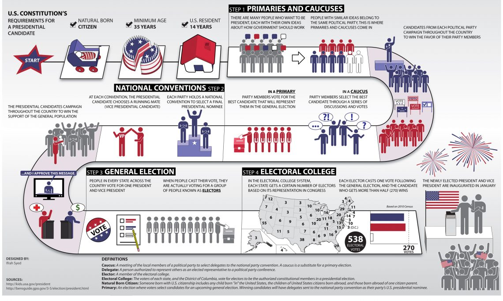

# The Road to the White House

## Primary Politics

### Caucus v. Primary?

The Constitution, state law, political party rules, and traditions shape the road to the White House.

> The text in the Constitution concerning presidential elections primarily appears in Article II, Sections 1, 2, and 3.
>
> - Article II, Section 1 outlines the process of electing the President and Vice President through the Electoral College.
> - Article II, Section 2 describes the powers and responsibilities of the President, including serving as the commander-in-chief of the armed forces and granting pardons.
> - Article II, Section 3 details the duties of the President, such as delivering the State of the Union address and ensuring that the laws are faithfully executed.
>
> Additionally, the Twelfth Amendment to the Constitution, ratified in 1804, modified the process for electing the President and Vice President by establishing separate Electoral College votes for each office.

In order to join the race for the presidency, candidates must first be nominated through caucuses and primaries. These candidates use the caucuses and primaries to test the waters and see if they stand a chance of becoming a candidate, assessing whether their candidacy is sufficient to raise money. Many of the initial candidates actually decide to drop out of the contest during the first phase of the election, with caucuses and primaries narrowing the field of candidates to one.

States are in charge of organizing primaries, and over time there have been two ways to what we refer to in a general way as “primaries”. We are currently in the primary phase. What is the difference between caucus and primary?

Every four years, American states hold either a primary election or caucuses, part of which is to choose that state's top Republican and Democratic presidential candidates. So what's the difference between the two? Caucuses are elections run by political parties, while primaries are run by state governments. In an open primary, registered voters select whichever candidate they want regardless of party affiliation; in a closed primary, voters must be registered with a political party and they can only select a candidate within their selected party. But caucuses are different. In some caucuses, secret ballots are cast, while in others, people openly show support for their favorite candidate. Caucus-goers gather to debate issues and share concerns. Caucus-goers in Iowa's Democratic caucus gather in groups to support their chosen candidate. If after the first round of grouping, a candidate doesn't have 15% support, they are deemed nonviable, and supporters in their group must either join another candidate's group or convince caucus-goers in other groups to join theirs until 15% is reached. In the 2020 election cycle, primaries and caucuses will run through the early summer, but a party's nominee is usually apparent well before the caucuses and elections are completed. However, across the US, Democrats and Republicans won't officially nominate their candidate until the party's national conventions next summer.

> Q&A:
>
> 1. **What states have primaries, and what states have caucuses?**
>
>    - States with Primaries Only:
>
>      Alabama, Arizona, Arkansas, California, Colorado, Connecticut, Delaware, Florida, Georgia, Illinois, Indiana, Kansas, Kentucky, Louisiana, Maryland, Michigan, Mississippi, Missouri, Montana, Nebraska, New Hampshire, New Jersey, New Mexico, New York, North Carolina, Ohio, Oklahoma, Pennsylvania, Rhode Island, South Carolina, Tennessee, Texas, Utah, Vermont, Virginia, Washington, West Virginia, Wisconsin
>
>    - States with Caucuses Only:
>
>      Iowa, Nevada
>
>    - States with a Combination of Primaries and Caucuses:
>
>      Alaska, Hawaii, Maine, Minnesota, North Dakota, Wyoming
>
>    - States with Other Nominating Processes:
>
>      - Massachusetts: Uses a combination of primaries and conventions.
>      - South Dakota: Uses a combination of primaries and conventions.
>      - Oregon: Conducts all voting by mail.
>      - Idaho: Holds closed primaries for presidential elections but caucuses for state elections.
>
> 2. **What is an open primary, closed primary, and semi-open primary?**
>
>    An open primary is a type of primary election in which voters are not required to declare their party affiliation and can choose to vote for any candidate, regardless of their party affiliation. In a closed primary, only voters who are registered members of a particular political party can participate and vote for candidates from that party. A semi-open primary is a hybrid of the two, where voters can choose to vote in either party's primary, but they may be required to publicly declare their party affiliation at the polling place.
>
> 3. **For states that have primaries only, do voters directly vote for their preferred presidential candidate, or do they vote for delegates?**
>
>    In states that have primaries only, voters directly vote for their preferred presidential candidate. The results of the primary determine the allocation of delegates to each candidate based on their share of the vote. These delegates then represent their candidate at the national party convention, where the party's nominee is officially chosen.
>
> 4. **For states that have primaries only, how are the exact delegates chosen?**
>
>    In states that have primaries only, the exact delegates are typically chosen through a process determined by each political party's rules. These rules often specify how delegates are allocated based on the results of the primary election. For example, delegates may be allocated proportionally to the candidates based on their share of the vote, or winner-takes-all in some cases. The specific method varies by state and party.
>
> 5. **What are the states where the winner takes all in the primary?**
>
>    States that operate under a "winner-takes-all" system in their primary elections include:
>
>    Florida, Ohio, Arizona, Illinois, New Jersey, Delaware, Missouri, District of Columbia, Montana (Republican)
>
>    Please note that these states may have variations in their winner-takes-all rules, such as awarding all delegates to the candidate who wins the statewide popular vote, or awarding delegates on a winner-takes-all basis within specific congressional districts.
>
> 6. **Is it state law or party rules that determine how delegates are allocated based on primary elections?**
>
>    Party rules typically determine how delegates are allocated based on primary elections. Each political party establishes its own rules for delegate allocation, which may vary from state to state. These rules govern factors such as whether delegates are allocated proportionally or on a winner-takes-all basis, the thresholds candidates must meet to receive delegates, and how uncommitted delegates are allocated. While state laws may have some influence, party rules generally have a more significant impact on delegate allocation.
>
> 7. **For states that have caucuses, how does it work?**
>
>    In states that have caucuses, the process typically involves voters gathering at local meetings to discuss and vote on their preferred presidential candidate. Caucus attendees may publicly express their support for a candidate, engage in debates, and participate in multiple rounds of voting if necessary. The results of the caucus determine the allocation of delegates to each candidate based on their level of support among caucus attendees. These delegates then represent their candidate at the party's county, district, and state conventions, ultimately leading to the selection of delegates to attend the national convention.
>
> 8. **Are primaries held at the state level or at the county and district level? What about caucuses?**
>
>    Primaries are typically held at the state level, where voters across the state participate in selecting their preferred presidential candidate. However, some states may also have primary elections at the county or district level for other political offices.
>
>    Caucuses, on the other hand, are usually held at the precinct or local level within a state. Voters gather in person at designated locations, such as schools or community centers, to participate in the caucus process and express their preferences for presidential candidates.
>
> 9. **In caucuses, do voters choose the presidential candidates or choose their delegates?**
>
>    In caucuses, voters typically participate in selecting both the presidential candidates and choosing delegates to represent them at subsequent party conventions. During the caucus process, voters express their preferences for presidential candidates, and the results determine the allocation of delegates to each candidate. These delegates then represent their candidate at county, district, and state conventions, ultimately leading to the selection of delegates to attend the national convention.
>
> 10. **If I want to be a delegate, what do I need to do?**
>
>     If you want to be a delegate, you typically need to get involved in the political party's process for selecting delegates. This often involves participating in local party meetings, precinct caucuses, or primary elections, where delegates are elected or selected to represent their area at higher levels of the party organization. You may need to express your interest in becoming a delegate and garner support from fellow party members to increase your chances of being selected. Additionally, understanding the rules and procedures set by the party for delegate selection can be crucial in navigating the process effectively.
>
> 11. **In a county or district, is there only one caucus meeting or multiple?**
>
>     In a county or district, there may be multiple caucus meetings held at different locations within the area. These meetings allow more voters to participate and ensure broader representation in the caucus process. The specific number of caucus meetings can vary depending on factors such as population size, geographic distribution, and party organization preferences.
>
> 12. **Who is eligible to attend a caucus meeting?**
>
>     Eligibility to attend a caucus meeting varies depending on the rules set by the political party and the state. Generally, individuals who are registered voters and affiliated with the party hosting the caucus are eligible to participate. However, some states allow same-day registration or participation regardless of party affiliation. It's essential to check the specific requirements set by the party and state to determine eligibility for attending a caucus meeting.
>
> 13. **How can one ensure that a voter does not attend caucus meetings multiple times at different locations? How can one ensure that individuals affiliated with another party do not participate in the caucus meeting?**
>
>     To prevent a voter from attending caucus meetings multiple times at different locations, caucus organizers typically maintain voter registration lists or check-in procedures to verify each attendee's eligibility and participation status. This helps ensure that individuals cannot attend multiple caucus meetings simultaneously.
>
>     To prevent individuals affiliated with another party from participating in the caucus meeting, caucus organizers may require attendees to provide proof of party affiliation or voter registration with the hosting party. Additionally, some states have closed caucuses, where only registered members of the party can participate, further ensuring that individuals from other parties do not attend. Organizers may also implement check-in procedures to verify party affiliation before allowing participation in the caucus.
>
> 14. **If I want to be a member of the Democratic Party , what should I do?**
>
>     To become a member of the Democratic Party, you typically need to register as a Democrat with your state's election office or board of elections. The process for registering may vary depending on your state's laws and regulations. In some states, you can register online, while in others, you may need to submit a paper registration form by mail or in person. You can usually find registration information and forms on your state's election website or by contacting your local election office.
>
> 15. **Who makes speeches for the presidential candidates during caucus meetings?**
>
>     During caucus meetings, supporters or representatives of presidential candidates typically make speeches advocating for their preferred candidate. These speeches aim to persuade undecided caucus participants and gather support for their candidate. The speakers may highlight the candidate's qualifications, policy positions, and accomplishments to sway caucus-goers. Additionally, candidates themselves may attend caucus meetings to deliver speeches and engage directly with voters.
>
> 16. **For states with a combination of primaries and caucuses, how does it work?**
>
>     In states with a combination of primaries and caucuses, the process can vary depending on the specific rules established by the political party and the state. Generally, some areas within the state may hold primary elections, where voters cast their ballots in a manner similar to general elections. In other areas, caucus meetings may be held, where voters gather to discuss and vote on their preferred presidential candidate.
>
>     The combination approach allows for flexibility in the nomination process and may reflect the preferences of different regions within the state. It can also provide opportunities for broader participation and engagement among party members. The specific details of how primaries and caucuses are conducted in these states are determined by party rules, state laws, and party organization preferences.
>
> 17. **For states that use a combination of primaries and conventions, how does it work? How does it differ from a general primary?**
>
>     In states that use a combination of primaries and conventions, the process typically involves both a primary election and a subsequent convention where delegates are selected.
>
>     During the primary election, voters cast their ballots to determine the allocation of delegates to each presidential candidate. These delegates are usually bound to support a specific candidate based on the primary results.
>
>     Following the primary, a convention is held where delegates from each candidate's campaign or supporters gather to formally elect delegates to represent them at the national convention. This convention may involve additional rounds of voting or negotiations to determine the final allocation of delegates.
>
>     The key difference from a general primary is the inclusion of a convention component, where delegates are formally selected to represent each candidate at the national level. This process allows for further deliberation and organization within the party before the final selection of delegates to the national convention.

## The Conventions

## The Electoral College

## The Presidential Election

## Inauguration Day

## The Role of Money in Elections

## The First 100 Days
