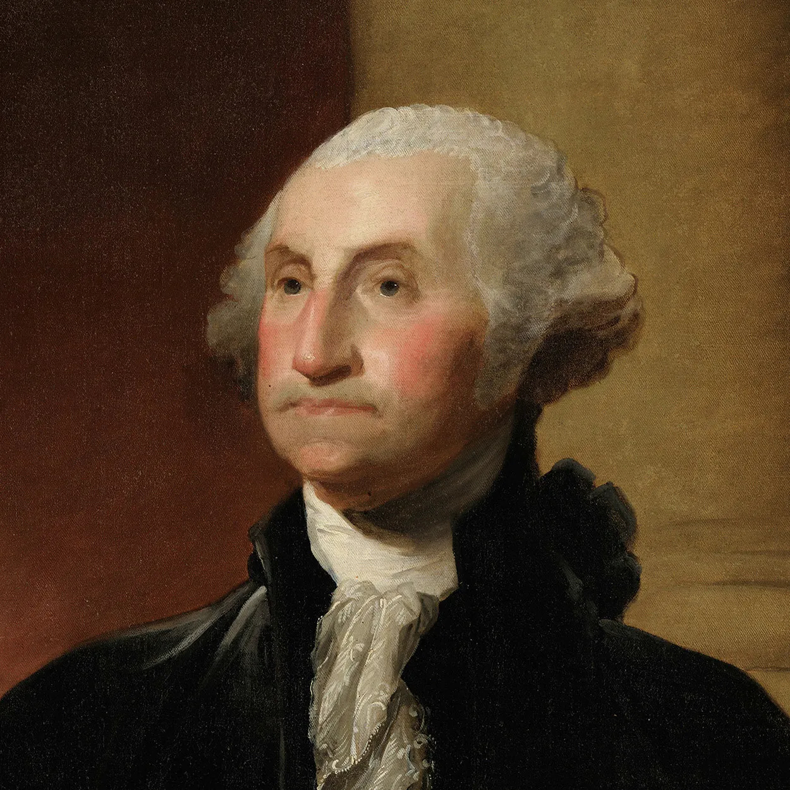

# Bringing the Constitutional Presidency to Life

## Introduction: From Presidential Leadership to the “Imperial Presidency”

Article 2 of the Constitution is intentionally vague and concise. Debates over the nature and extent of presidential powers outlined in the article are extensive. As a result of this vagueness, presidents, members of the Court, and Congress have engaged in debates regarding the nature and scope of presidential powers.

> The Constitution defines presidential powers primarily in Article II, Sections 2 and 3. Here are the relevant excerpts:
>
> Article II, Section 2:
>
> "The President shall be Commander in Chief of the Army and Navy of the United States, and of the Militia of the several States, when called into the actual Service of the United States; he may require the Opinion, in writing, of the principal Officer in each of the executive Departments, upon any Subject relating to the Duties of their respective Offices, and he shall have Power to grant Reprieves and Pardons for Offences against the United States, except in Cases of Impeachment."
>
> Article II, Section 3:
>
> "He shall from time to time give to the Congress Information of the State of the Union, and recommend to their Consideration such Measures as he shall judge necessary and expedient; he may, on extraordinary Occasions, convene both Houses, or either of them, and in Case of Disagreement between them, with Respect to the Time of Adjournment, he may adjourn them to such Time as he shall think proper; he shall receive Ambassadors and other public Ministers; he shall take Care that the Laws be faithfully executed, and shall Commission all the Officers of the United States."

“experience did demonstrate rather quickly that the system of checks and balances would not work at all unless one of the three branches took the initiative and that it worked best in response to vigorous presidential leadership. Such leadership [...] enabled the American republic to meet the great crises of history. [...] In the last years, presidential primacy, so indispensable to the political order, has turned into presidential supremacy. The constitutional presidency [...] has become the imperial presidency.” (Arthur M. Schlesinger Jr., The Imperial Presidency, 1973)

The text reflects on the transition from presidential leadership (viewed positively) to the concept of the "Imperial Presidency" (seen in a negative light).

- There was a shift from the primacy of the executive branch (viewed positively) to its supremacy (criticized, leading to what is now termed an 'imperial presidency').

- According to the author, the Imperial presidency is weakening the system of checks and balances by concentrating too much power in the hands of the President (Presidents have succeeded in augmenting presidential power).

## The Washington Presidency: Setting Precedents

The Washington presidency was the first to establish precedents that subsequent presidents had to respect. Many of the situations that historically defined the office were the result of precedents set by George Washington, the first president of the US.

Prior to becoming the first president, he was a Revolutionary War general. As a war hero whom people trusted, his legacy continued to define the presidency.

> George Washington's role as a Revolutionary War general was crucial to the success of the American colonies in gaining independence from Great Britain. He was appointed as Commander-in-Chief of the Continental Army by the Second Continental Congress in 1775, shortly after the outbreak of hostilities with the British.
>
> Washington faced significant challenges in leading an army that was often under-equipped, poorly trained, and lacking in resources. However, he demonstrated strong leadership, strategic acumen, and resilience throughout the war.
>
> One of Washington's most notable achievements was his ability to keep the Continental Army together during difficult times, such as the harsh winter at Valley Forge in 1777-1778. Despite facing extreme cold, disease, and shortages of supplies, Washington's leadership helped to maintain morale and cohesion among his troops.
>
> Washington also made strategic decisions that played a crucial role in securing American victory. His surprise crossing of the Delaware River on December 25, 1776, followed by the successful attack on Hessian forces at Trenton, New Jersey, was a turning point in the war and boosted American morale.
>
> Throughout the Revolutionary War, Washington faced formidable British generals such as Sir William Howe, Sir Henry Clinton, and Lord Cornwallis. Despite setbacks and defeats, Washington persevered and eventually forced the British to surrender at the Battle of Yorktown in 1781, effectively ending the war.
>
> Washington's leadership as a Revolutionary War general earned him the respect and admiration of his fellow Americans and solidified his reputation as one of the great military leaders in history. His contributions to the cause of American independence laid the foundation for the establishment of the United States as a free and sovereign nation.

As head of the executive branch, Washington was responsible for enforcing the government that the Constitution had created. Washington and the first Federal Congress realized that the Constitution did not have all the answers to the problems that the country would face. The way they addressed these problems established precedents, defining how future presidents should deal with similar situations.

Washington himself was very aware of the gravity of the task. In a letter to Madison, he said: “As the first of everything in our situation will serve to establish a Precedent, it is devoutly wished on my part, that these precedents may be fixed on true principles.”

### Problems Facing the Early Republic

The major political questions and conflicts during the 1790s concerned foreign policy, economic policy, and the balance of power between the states and the federal government. These issues had been subjects of extensive discussion and debate during the drafting of the Constitution.

#### Foreign Policy

At the start of the French Revolution in 1789, the US had just ratified its constitution. When French revolutionaries came to the US asking for assistance, hoping to enlist its support, Washington decided to issue a **proclamation of neutrality**. This proclamation guaranteed that the US would not take anyone's side. It was a risky decision because France had been a major ally of the US during the Revolutionary War.

Despite France's crucial aid during the Revolutionary War, Washington issued the Proclamation of Neutrality in 1793. This decision was significant, as it marked a departure from America's previous alliance with France and established a stance of neutrality in the conflict between France and Britain.

With that proclamation of neutrality, Washington set a precedent in terms of foreign policy for **isolationism**, which can be defined as refraining from involvement in international affairs. His proclamation of neutrality would shape American foreign policy over the next century.

> During the French Revolution, which began in 1789, France was embroiled in a conflict that soon evolved into a full-scale war with various European powers. The revolution raised questions about how the United States, a relatively new nation, should respond.
>
> In 1793, President George Washington issued a proclamation of neutrality, signaling that the United States would not take sides in the conflict between France and Britain. This decision was influenced by several factors:
>
> 1. Preservation of U.S. interests: Washington and his administration believed that remaining neutral would protect American interests, including trade and security. Taking sides in the conflict could potentially harm these interests.
>
> 2. Political divisions: There were significant divisions within the United States regarding support for the French Revolution. While some Americans, particularly supporters of Thomas Jefferson's Democratic-Republican Party, sympathized with the revolutionaries' ideals of liberty and democracy, others were wary of the revolution's radical nature and its implications for stability.
>
> 3. Avoidance of entanglement in European conflicts: Washington and many of the Founding Fathers were wary of getting involved in the complex web of European power struggles. They believed that the United States, as a new nation, should focus on building its own institutions and avoiding entanglements in distant conflicts.
>
> By proclaiming neutrality, Washington sought to maintain peace and stability for the young nation while navigating the challenges posed by the turbulent events unfolding in Europe.

#### Domestic Policy

The problems stemmed from economic issues that the country encountered, especially the fact that after the American Revolution, the US faced the challenge of a large national debt. The crisis was caused, as a consequence of this substantial national debt, even before George Washington was elected president.

##### Shays’ Rebellion (MA, 1786-87) & Whiskey Rebellion (PA, 1791-1794) ⇨ Need for a Stronger Federal Government & a Strong Executive

The first was a rebellion known as **Shays’ Rebellion**, conducted by farmers in Western Massachusetts. It was linked to the aftermath of the American Revolution and the issue of debt. Following the Revolution, the leaders of the former colonies imposed heavy taxes to finance the nation, which many people felt were an unfair burden. Those who had participated in the war were still awaiting compensation for their service. The state was indebted not only to other countries such as France but also to its citizens. Farmers, in particular, were severely affected by these new taxes and rose up in protest. While the rebellion was eventually suppressed, it caused deep concern among the Founding Fathers. This event highlighted the need for a stronger federal government, prompting the Founding Fathers, operating under the Articles of Confederation, to recognize the necessity of a new constitution. They realized the need for a strong federal government capable of quelling such uprisings.

> Shays' Rebellion was a significant event in American history that occurred in 1786-1787. It was named after its leader, Daniel Shays, a former Revolutionary War captain. The rebellion took place in Massachusetts and was sparked by economic hardships faced by farmers, including high taxes and foreclosure of their farms due to debt. The rebellion involved armed protests and attempts to shut down courts to prevent foreclosures and debt collection. Although the rebellion was eventually suppressed by state militia and federal forces, it highlighted the weaknesses of the Articles of Confederation and the need for a stronger central government, ultimately contributing to the Constitutional Convention and the drafting of the United States Constitution.

The second rebellion, occurring during Washington's first term, was the **Whiskey Rebellion**, a consequence of the tax levied on whiskey in 1791 to raise funds to repay the national debt from the war. This rebellion, an armed resistance movement, took place in Pennsylvania. It ended when Washington ordered a force of about 13,000 troops to suppress the resistance. The Whiskey Rebellion demonstrated that the federal government was capable of handling political unrest and was stronger than it had been under the Articles of Confederation. Unlike the previous system, the new constitution empowered the government to form a military.

> The Whiskey Rebellion occurred in the western frontier regions of the United States, primarily in western Pennsylvania, between 1791 and 1794. It was sparked by the imposition of a federal excise tax on whiskey by the newly formed federal government under President George Washington and Treasury Secretary Alexander Hamilton. The tax was particularly burdensome for western farmers who relied on whiskey production as a means of converting their surplus grain into a more easily transportable and marketable commodity. The rebellion involved acts of resistance, including protests, intimidation of tax collectors, and, in some cases, violence against government officials. President Washington responded by issuing a proclamation urging the rebels to disperse and later dispatched a militia force to suppress the rebellion. The Whiskey Rebellion was ultimately quelled without significant bloodshed, but it demonstrated the federal government's willingness and ability to enforce its authority and uphold the rule of law, thus solidifying the power of the federal government, setting a precedent for dealing future challenges to its authority, and establishing the principle of federal supremacy over state and local interests.

##### Large National Debt ⇨ Balance of Power between the States and the Federal Government

The second issue which the Washington presidency had to face was also linked with the large national debt from the American Revolution. There the question was, after the Constitution, with the states now governed under a central government, who would be responsible for that debt? Since the states had contracted debts individually, the dilemma was whether each state should be responsible for repaying its debts or whether the new federal government should assume the debt. Treasury Secretary Alexander Hamilton proposed a solution to this problem, suggesting that the federal government should assume the debts of the states. Additionally, he proposed the creation of a National Bank, believing that it would help stimulate business growth by providing federally backed currency.

Now, there was just one problem: the Constitution said nothing about creating a national bank. So the main constitutional question surrounding the creation of the National Bank was: does Congress have powers that are not explicitly stated in the Constitution? The answer, obviously given by Alexander Hamilton and his followers, was yes. Hamilton believed that under the 'necessary and proper clause' of Article I of the Constitution, which states that Congress has the power to make all laws that shall be necessary and proper for carrying into execution its duties, Congress had the right to create the bank to address the national debt problem.

> The "necessary and proper clause," also known as the "elastic clause," is found in Article I, Section 8, Clause 18 of the United States Constitution. It grants Congress the power to pass all laws that are deemed "necessary and proper" for executing its enumerated powers and carrying out its responsibilities. The text of the clause is as follows:
>
> "The Congress shall have Power ... To make all Laws which shall be necessary and proper for carrying into Execution the foregoing Powers, and all other Powers vested by this Constitution in the Government of the United States, or in any Department or Officer thereof."

The project of creating the National Bank led to political divisions between two factions: one led by Hamilton and another by Thomas Jefferson and James Madison. Thomas Jefferson and his followers disagreed with Hamilton's arguments, viewing them as a misinterpretation of the clause. They believed that creating a National Bank amounted to an abuse of power by the federal government. After much debate between these emerging political factions, the bill establishing the First Bank of the US passed both the House and the Senate, and was signed into law by President Washington in 1791.

> The First Bank of the United States and the Federal Reserve are both central banking institutions in the United States, but they served different purposes and operated in different historical contexts.
>
> The First Bank of the United States was established in 1791 by the U.S. Congress and President George Washington. It was created to address various economic issues facing the young nation, including stabilizing the currency, managing public debt, and promoting economic growth. The First Bank was the brainchild of Alexander Hamilton, the first Secretary of the Treasury, who saw it as a way to establish financial stability and enhance the federal government's power to regulate the economy. The bank had a 20-year charter and was headquartered in Philadelphia.
>
> On the other hand, the Federal Reserve System, often referred to simply as the Federal Reserve, was established in 1913 through the Federal Reserve Act. It was created in response to a series of financial panics and banking crises that occurred in the late 19th and early 20th centuries. The Federal Reserve serves as the central bank of the United States and is responsible for conducting monetary policy, supervising and regulating banks, and maintaining the stability of the financial system. It is composed of 12 regional Federal Reserve Banks located throughout the country, along with the Board of Governors in Washington, D.C.
>
> While both institutions have roles in overseeing the nation's banking and financial systems, the First Bank of the United States was a precursor to modern central banking, whereas the Federal Reserve is the central banking system currently in place in the United States.

##### Political Factions ⇨ 1st Party System (Democratic-Republicans v. Federalists)

Now, those political factions that emerged soon formed the first two political parties of the country, creating what is called the first party system. This system comprised two parties: the Federalists, who believed in a strong federal government—led by figures like Hamilton, and the Democratic-Republicans. The Democratic-Republicans, led by Thomas Jefferson, often referred to themselves as Republicans, but this term has no relation to the current Republican Party. These two parties represented the earliest political divisions under which the country operated.

### Washington's Farewell Address

Washington's presidency was significant beyond merely being the first; his actions established strong federal governance and laid out a plan to address the problem of national debt. As he concluded his presidency, Washington delivered a farewell address, which is the address the president delivers at the end of his term, setting yet another precedent.

> The Farewell Address is a speech given by a U.S. President at the end of their time in office, typically as they are leaving office after serving two terms or choosing not to seek re-election. Recent presidents who have delivered Farewell Addresses include Barack Obama in 2017 and Donald Trump in 2021. In these addresses, presidents often reflect on their time in office, offer advice to the nation, and outline their hopes for the future. Farewell Addresses are considered significant moments in American political history, providing insight into the president's legacy and their vision for the country. One of the most famous Farewell Addresses is that of George Washington in 1796, where he warned against the dangers of political factionalism and foreign entanglements, setting a precedent for future presidents.

Washington's presidency was significant beyond merely being the first; his actions established strong federal governance and laid out a plan to address the problem of national debt. As he concluded his presidency, Washington delivered a farewell address, which is the address the president delivers at the end of his term, setting yet another precedent. In this address, he advised the country to avoid political factions based on geography or party affiliation. He also cautioned against forming long-term alliances with other countries, reflecting an isolationist view of foreign policy. He said in his farewell address that "the great rule of conduct for us in regard to foreign nations is in extending our commercial relations, to have with them as little political connection as possible." He was essentially talking about European countries and wanted the US to stay away from the conflicts that were going on in Europe.

## Consolidating the Constitutional Presidency
